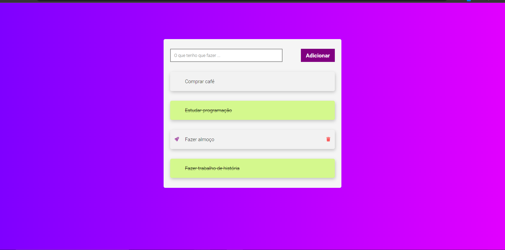

# Lista de Tarefas

> Projeto de lista de tarefas, feito com JavaScript, CSS, HTML, meu primeiro contato com programação.

### Experiência que Consegui

:

- [x] Aprendi mais sobre HTML
- [x] Aprendi CSS
- [x] Primeira vez com JavaScript

## 🤝 Colaboradores

Agradecemos às seguintes pessoas que contribuíram para este projeto:

<table>
  <tr>
    <td align="center">
      <a href="https://github.com/dev-joao-dev">
         
        
          <b>João Vitor</b>
        
      </a>
    </td>
  </tr>
</table>
